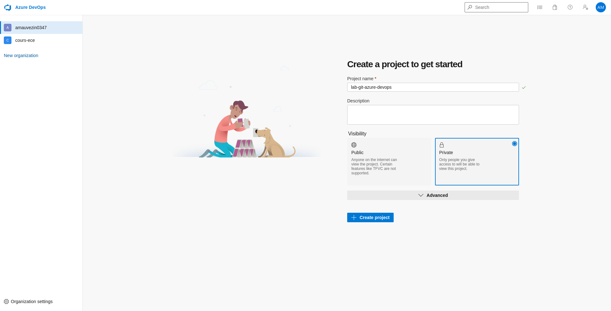
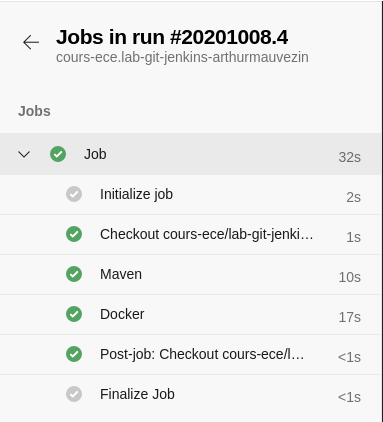
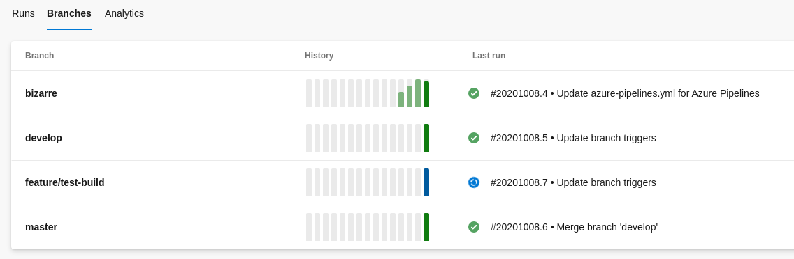

# TP 1 : CI/CD

## Instructions
Les réponses aux questions posées dans cet énoncé doivent être soumises sous forme d'issue GitHub au sein de votre copie de repository. 
Chaque réponse fera l'objet d'une nouvelle issue dans votre repo. 
> Les questions requérant une réponse sous forme d'issue seront taggées par l'icone suivante: ⚠️ 

> Les commits ne sont pas facultatifs. **Commitez au minimum dès que l'énoncé vous le demande**.

Le TP doit être rendu individuellement et se basera sur les réponses présentes dans les issues, ainsi que sur le code présent dans vos repositories personnels.

## Rappels
### Git
[Git Documentation Officielle](https://git-scm.com/docs)
Commande | Description
-- | --
`git clone` | Cloner un repository sur son poste
`git add` | Ajouter des fichiers à la staging area (qui sera prise en compte dans le prochain commit)
`git commit` | Créer un nouveau commit en local
`git push` | Pousser son arbre de commit local avec le serveur (Local --> GitHub)
`git pull` | Synchroniser son arbre local avec l'arbre distant (Local <-- GitHub)
`git branch` | Créer une nouvelle branch locale
`git merge` | Appliquer les changements d'une branche sur une autre branche localement

### Gitflow


### Pull request


### Github
* Classroom
* Issue

### Azure DevOps
* Service SaaS - [dev.azure.com](https://dev.azure.com)
* Pipeline: CI vs CD
* Pipeline: Configuration as code

---
---
---

## 1 : Git 

### 1.0 : Création de compte Github
Allez sur [Github](https://github.com/) et se créer un compte si ce n'est pas déjà la cas.

### 1.1 : Accepter l'assignment 
Suivez le lien présent au tableau ou dans le channel de votre groupe Discord pour récupérer une copie personnelle de ce repository dans l'organisation GitHub Classroom `cours-ece`.

### 1.2 : Cloner le repository
Clonez le repo nouvellement copié sur votre ordinateur 
 
### 1.3 : Faire un commit 
Dans votre repo, éditez le fichier identity.md et remplissez le avec vos données personnelles (nom, prénom, id)

Committez et pushez les changements apportés au fichier
> Les commits ne sont pas facultatifs. **Commitez au minimum dès que l'énoncé vous le demande**.

> ⚠️  **ANSWER**: Créez une issue s'intitulant `1.3` ayant pour contenu les commandes que vous avez effectué pour réaliser le commit et le push de vos changements.

### 1.4 : Naviguer dans les logs
Affichez les logs des commits précédents.

Faites attention au fait que tout est loggué depuis le début du projet. Vous pouvez trouver les messages, les dates mais aussi les auteurs des commits passés.

> ⚠️  **ANSWER**: Créez une issue s'intitulant `1.4` ayant pour contenu la commande que vous avez effectué pour visualiser les logs.

### 1.5 : Avez-vous vu Ginny ?
A l'aide de la commande utilisée dans la question précédente, retrouvez la trace de **Ginny**.

> **Indice**: Cherchez dans la documentation de la commande précédente pour trouver des idées de commandes.

> ⚠️  **ANSWER**: Créez une issue s'intitulant `1.5` ayant pour contenu **uniquement la commande** que vous avez effectué pour retrouver votre mot de passe perdu.

### 1.6 : Listez les branches
Listez **toutes** les branches présentes dans le repository.

Est-ce que toutes les branches vous paraissents normales ? Y a t-il une branche qui retient votre attention ? 
Si oui, déplacez vous dessus (checkout).

> ⚠️  **ANSWER**: Créez une issue s'intitulant `1.6` ayant pour contenu la commande que vous avez effectué pour afficher les branches présentes dans votre repo et le nom de la branche qui a retenu votre attention.

### 1.7 : Créez une branche
Créez une branche à partir de la branche trouvée dans la question précédente. La branche à créer doit s'appeler `feature/` suivi de la première lettre de votre prénom puis du nom de famille en minuscule (pas d'espace ni d'accent dans le nom).

> Ex Albus Dumbledore --> feature/adumbledore

Puis, placez vous sur votre branche `feature/{nom}` nouvellement créée.

> ⚠️  **ANSWER**: Créez une issue s'intitulant `1.7` ayant pour contenu les commandes que vous avez effectué pour créer et vous déplacez sur la nouvelle branche.

### 1.8 : Ah, c'est la que tu aurais aimé suivre le dernier cours ...
Répondez aux questions contenues dans le fichier questions.md, puis committez les changements sur la branche `feature/{nom}`.
Enfin, pushez tous vos changements présents réalisés sur toutes les branches sur votre repository GitHub.

> ⚠️  **ANSWER**: Créez une issue s'intitulant `1.8` ayant pour contenu les commande que vous avez effectué pour pusher toutes les branches sur votre repo GitHub.

### 1.9 : Pull request time !!
Dans l'interface web GitHub, ouvrez une pull request partant de votre branche `feature/{nom}` pointant sur la branche develop de votre repository.

> **Warning**: Pensez bien à nous ajouter (laurent et arthur) en tant que reviewer de votre pull request afin que je puisse vous corriger.

Pour plus d'aide sur les pull requests voir la [documentation officielle](https://help.github.com/articles/about-pull-requests/)

### 1.10 : Gitflow
Lister les branches présentes dans le repo. Au sens Gitflow, à quoi servent ces chacunes de ces branches ?

> ⚠️  **ANSWER**: Créez une issue s'intitulant `1.10` ayant pour contenu la description des branches existantes dans la méthodologie Gitflow qui sont présentes dans votre repository. (ex: la branche master sert à ...)

---
---
---

## 2 : CI/CD avec Azure DevOps
Dans cette seconde partie, vous devez utiliser le même repo que celui obtenu à la fin de la partie 1.

> ⚠️  **WARNING**: Chacunes des questions demandant une modification de code nécessite au minimum un commit et un push dans votre repository. Le découpage des commits est pris en compte dans la notation.

> Pour réaliser l'ensemble des étapes demandées dans cette partie, vous vous placerez sur la branche `develop`

---
Le but de cette seconde partie de TP est d'implémenter un pipeline CI (intégration continue) permettant d'automatiser:
* le téléchargement des dépendances utiles au build applicatif
* le build de l'application
* les tests de l'application et leur mise à disposition dans une UI utilisable par n'importe qui
* le package de l'application

Pour cela, nous allons utiliser une solution SaaS de Microsoft appelée **Azure DevOps**.

Cette solution permet notamment grâce à son système de pipeline (Azure Pipelines) d'implémenter les automatisations que nous voulons réaliser dans ce TP.

Les pipelines sont décrits à travers des fichiers de code YAML (pipeline as code).

Pour avoir un aperçu des fonctionnalités d'Azure Pipelines, [voir la page officielle](https://azure.microsoft.com/en-us/services/devops/pipelines/)
Pour plus de documentation sur la syntaxe des fichier YAML, [voir la documentation officielle](https://docs.microsoft.com/en-us/azure/devops/pipelines/yaml-schema?view=azure-devops&tabs=schema%2Cparameter-schema)

> **Important**: La documentation ci-dessus sera indispensable pour pouvoir mener à bien ce TP et les suivants.
---

### 2.0 : Création de l'organization Azure DevOps
Rendez-vous sur [le portail Azure DevOps](https://dev.azure.com/), cliquez sur `Sign in to Azure DevOps` puis authentifiez vous avec vos identifiants ECE (compte office 365)

Vous allez être redirigé vers le portail Azure DevOps sur une page spécifique à votre organisation vous demandant de créer un projet.

Créez un projet s'intitulant `lab-git-azure-devops` an laissant le reste de la configuration par défaut, puis valider en cliquant sur `Create project`



### 2.1 : Création de votre premier Pipeline - Build & Test
Une fois votre projet créé, allez dans le menu `Pipelines` de votre projet et cliquez sur `Create Pipeline`.
Cela va avoir pour effet d'afficher un wizard vous permettant de configurer la connexion entre votre repository GitHub et Azure DevOps.

Suivez les instructions du Wizard en précisant:
* Type de code: `GitHub`
* le lien vers votre repository (vous devrez accepter les droits demandés par Azure DevOps sur votre repository GitHub)
* Le type de pipeline : `Maven`

Au terme de la configuration, le Wizard vous affiche le fichier YAML correspondant à la Continuous Integration (CI) que vous êtes en train de créer.

Ce fichier décrit plusieurs étapes essentielles à la mise en place d'un pipeline:
* **trigger**: Quand les automatismes réalisés dans ce pipeline vont-ils se déclencher
* **pool**: Sur quelle machine les automatisation implémentées dans ce pipeline vont se dérouler
* **steps**: La description des étapes à automatiser

Vous pouvez maintenant cliquer sur le bouton `Save and run`.
Observez dans la UI Azure DevOps les différentes étapes de build, les différentes informations relatives aux délais d'exécution et les résultats de tests.

### 2.2 : Ajout du packaging
Jusqu'ici le pipeline build et test l'applicatif mais aucun package n'est ŕealisé ou persisté. Vous allez créer une image Docker afin de persister notre applicatif à la fin du build.

Pour cela, créer un fichier Dockerfile à la racine de votre projet contenant le code suivant:
```dockerfile
FROM maven:3.3.9-jdk-8-alpine

COPY target/my-app-1.0-SNAPSHOT.jar /root/my-app-1.0-SNAPSHOT.jar

CMD ["java", "-jar", "/root/my-app-1.0-SNAPSHOT.jar"]
```

Editez votre pipeline pour ajouter la step de packaging. Pour cela, utilisez l'assistant (sur la droite de la page) pour rechercher la task `Docker`.

Sélectionnez cette task et remplir les valeurs suivantes:

Intitulé | Valeur
-- | --
Container repository | myapplication
Command | build
Dockerfile | \*\*/Dockerfile

Cliquez ensuite sur le bouton `Add` afin d'ajouter la task au format texte au sein de votre fichier YAML.
Sauvez votre pipeline et observez sa bonne execution après packaging.

### 2.3 : Amélioration de l'affichage
Pour l'instant les étapes réalisées par la CI ne sont pas très explicites en terme de logs (cf. screenshot ci-dessous)



Trouvez un moyen d'améliorer la lisibilité en modifiant l'affichage des titres de chacune des steps.

### 2.4 : Mise en place de la gestion multi-branche
Pour l'instant votre pipeline ne se déclanche que sur une branch (cf. trigger).

Modifiez la valeur du trigger afin de lancer le pipeline sur toutes les branches de type:
* master
* develop
* feature (attention, regarder la nomenclature gitflow)

Après avoir réalisé ces changements, mergez tous vos changements proprement jusqu'à master

### 2.5 : Création d'une nouvelle branche
Votre pipeline est maintenant prêt à exécuter les étapes définies en son sein quelles que soient les branches qui soient créées. 

Créez une branche `feature/test-build` à partir de la branch develop et constatez que le build est automatiquement appliqué sur cette branche.



### 2.6 : Conclusion
Vous pouvez maintenant créer plusieurs branches features et vous apercevoir que ces branches se verront appliquée les étapes de build, test et package.

Toute cette configuration permet d'avoir un système de validation au plus près sans perdre de temps sur les feedback rapides attendus pour améliorer la qualité des produits.
